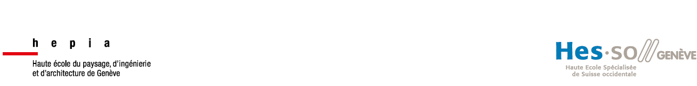

# DropTower

## All about the drop tower at HEPIA Genève
The DropTower is a test rig designed to perform destructive tests (Crash-Test).

Its design began in 2022, and the first test took place in July 2023.
The 23-meter-high shaft spans 6 floors of hepia. It is controlled from a basement room adjoining the drop room.

The code found in this repository is currently only about the control interface.
